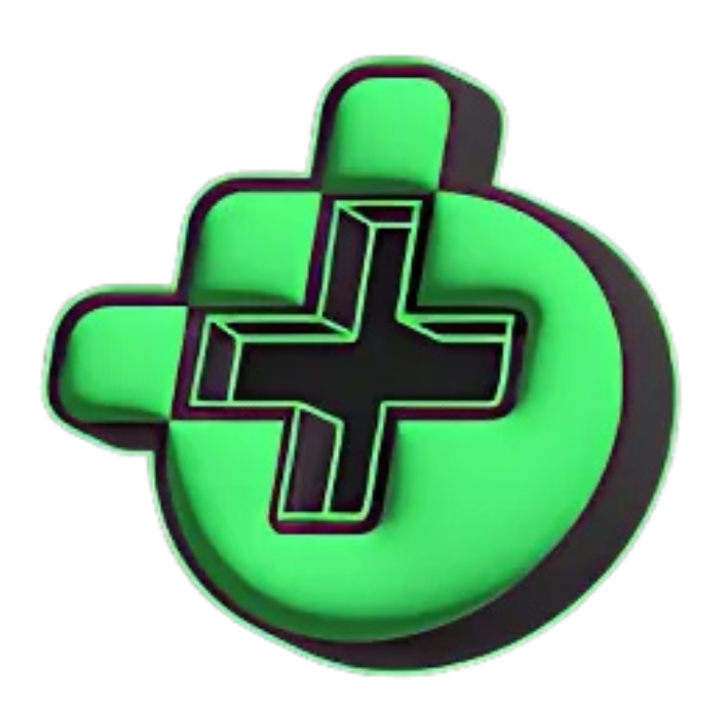

<div align="center">
  
  
  # 🎮 MaisEsports YouTube Tracker
  
  **Uma extensão experimental para Chrome que monitora o canal MaisEsports no YouTube**
  
  [](https://github.com/Gor0d/mais-esports-yt-tracker/releases/latest)
  [](.)
</div>

---

## ✨ Funcionalidades

<div class="features-grid">
  <div class="feature">
    <h3>🔔 Notificações Automáticas</h3>
    <p>Receba alertas instantâneos quando novos vídeos são publicados no canal MaisEsports</p>
  </div>
  
  <div class="feature">
    <h3>🎯 Filtro Inteligente</h3>
    <p>Monitora apenas vídeos longos, excluindo automaticamente os YouTube Shorts</p>
  </div>
  
  <div class="feature">
    <h3>🖼️ Preview Visual</h3>
    <p>Veja a thumbnail do último vídeo detectado diretamente no popup da extensão</p>
  </div>
  
  <div class="feature">
    <h3>⚡ Acesso Rápido</h3>
    <p>Botão direto para assistir ao vídeo no YouTube com apenas um clique</p>
  </div>
</div>

---

## 📥 Instalação

### Método 1: Download Direto

1. **[📦 Baixe a última versão](https://github.com/Gor0d/mais-esports-yt-tracker/releases/latest)**
2. Extraia o arquivo ZIP
3. Acesse `chrome://extensions/` no Chrome
4. Ative o **"Modo do desenvolvedor"**
5. Clique em **"Carregar sem compactação"**
6. Selecione a pasta extraída

### Método 2: Clonar Repositório

```bash
git clone https://github.com/Gor0d/mais-esports-yt-tracker.git
cd mais-esports-yt-tracker
```

---

## 🎯 Como Usar

<div class="usage-steps">
  <div class="step">
    <h3>1. Instalação</h3>
    <p>Instale a extensão seguindo os passos acima</p>
  </div>
  
  <div class="step">
    <h3>2. Ativação</h3>
    <p>A extensão começará a monitorar automaticamente a cada 15 minutos</p>
  </div>
  
  <div class="step">
    <h3>3. Notificações</h3>
    <p>Receba alertas quando novos vídeos forem detectados</p>
  </div>
  
  <div class="step">
    <h3>4. Acesso</h3>
    <p>Clique no ícone da extensão ou na notificação para assistir</p>
  </div>
</div>

---

## 📸 Screenshots

### Interface Principal


### Notificação Desktop


---

## 🔧 Tecnologias Utilizadas

- **Chrome Extension Manifest V3** - API mais recente
- **JavaScript ES6+** - Programação moderna
- **RSS Feed** - Método principal de detecção
- **Web Scraping** - Backup para casos especiais
- **CSS3** - Animações e efeitos visuais

---

## ⚠️ Importante

> **Projeto Experimental**: Esta extensão foi desenvolvida para fins educacionais e experimentais. Não é um produto oficial do MaisEsports.

### Limitações Conhecidas

- ⏱️ Pode levar até 15 minutos para detectar novos vídeos
- 🌐 Funciona apenas em navegadores Chromium
- 🔧 Dependente da estrutura atual do YouTube
- 📊 Sem coleta de dados pessoais

---

## 🤝 Contribuindo

Contribuições são bem-vindas! Este é um projeto experimental aberto para aprendizado.

1. **Fork** o projeto
2. **Crie** uma branch (`git checkout -b feature/nova-funcionalidade`)
3. **Commit** suas mudanças (`git commit -m 'Adiciona nova funcionalidade'`)
4. **Push** para a branch (`git push origin feature/nova-funcionalidade`)
5. **Abra** um Pull Request

---

## 📝 Licença

Este projeto está sob a licença MIT. Veja o arquivo [LICENSE](LICENSE) para mais detalhes.

---

## 📞 Contato

- **GitHub**: [@Gor0d](https://github.com/Gor0d)
- **Issues**: [Reportar Problema](https://github.com/Gor0d/mais-esports-yt-tracker/issues)

---

<div align="center">
  <p><strong>Feito com ❤️ para a comunidade de esports brasileira</strong></p>
  <p><em>"Nunca perca um vídeo do seu portal de esports favorito!"</em></p>
</div>

<style>
  .features-grid {
    display: grid;
    grid-template-columns: repeat(auto-fit, minmax(250px, 1fr));
    gap: 1.5rem;
    margin: 2rem 0;
  }
  
  .feature {
    padding: 1.5rem;
    border: 1px solid #00ff7f;
    border-radius: 8px;
    background: rgba(0, 255, 127, 0.05);
  }
  
  .feature h3 {
    color: #00ff7f;
    margin-bottom: 0.5rem;
  }
  
  .usage-steps {
    display: grid;
    grid-template-columns: repeat(auto-fit, minmax(200px, 1fr));
    gap: 1rem;
    margin: 2rem 0;
  }
  
  .step {
    text-align: center;
    padding: 1rem;
    border-radius: 8px;
    background: rgba(26, 26, 26, 0.3);
  }
  
  .step h3 {
    color: #00ff7f;
    margin-bottom: 0.5rem;
  }
</style>